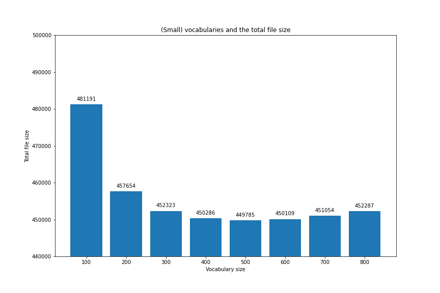
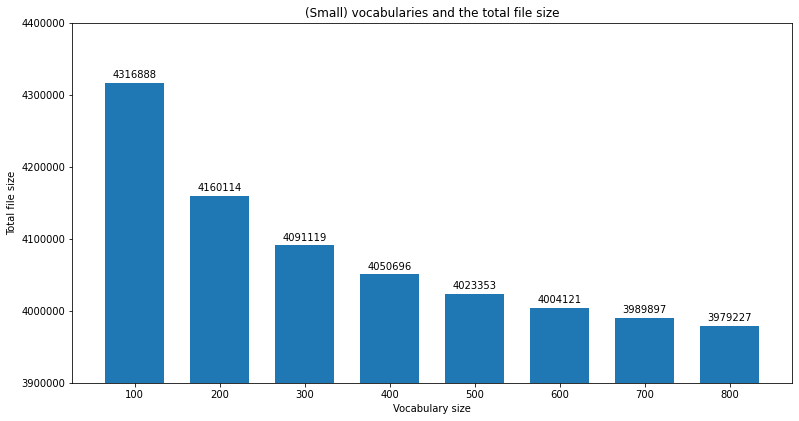
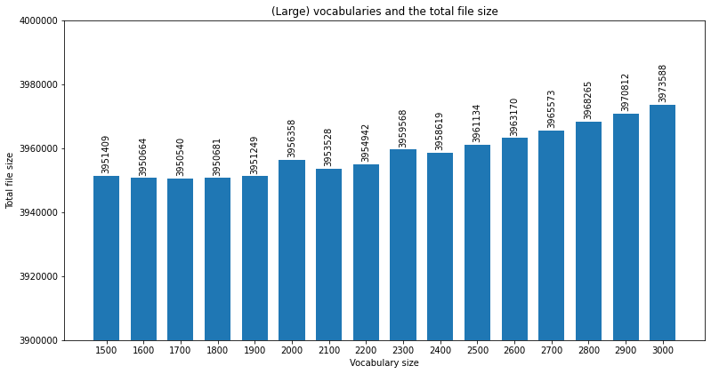

# SNLP project 

Name 1: Minh Tung Phung 
Id 1: 7012522 
Email id 1: miph00001@teams.uni-saarland.de 

Name 2: Pablo Valdunciel 
Id 2: 7010186  
Email id 2: pava00001@stud.uni-saarland.de  

## A. English 

### 0. Language overview
Some characteristics of the English language are:

- Native speakers: around 360 million
- Language family: 	Indo-European > Germanic > West Germanic > Ingvaeonic > Anglo-Frisian > Anglic > English
- Vocabulary size: 170,000 words, or 220,000 if obsolete words are counted.
- Writing system: 
    + written in [Latin alphabet](https://en.wikipedia.org/wiki/Latin_alphabet)
    + 26 letters, plus their corresponding capital form
    + 14 puntuaction marks
- Phonology: 
    + 24 consonant phonemes
    + pronunciation of vowels varies a great deal between dialects 

### 1. Data Preparation - Preprocessing 

**Assumptions**:
- Two-or-more end-of-line symbols (i.e. '\n\n') signify the separation of two paragraphs.
- No single sentence resides in more than one paragraph.
- We are allowed to use nltk for sentence-tokenization. The function from nltk (nltk.tokenize.sent_tokenize) is sufficient for the task.
- There is no situation where double-space (i.e. '  ') makes sense, so we contract all sequences of more than one space into a space character (i.e. from the regex point of view, ' +' is substituted with ' ').

**Operations**:
- Get a list of paragraphs by splitting the text by at-least-2 consecutive end-of-line characters (i.e. '\n{2,}').
- For each paragraph:
    + Replace all end-of-line characters with a space.
    + Contract all sequences of more than one space into a space character.
    + Tokenizer into sentences.
- Collect all sentences from all paragraphs as a list and return.

### 2. Subword Segmentation

In this section, we work on 3 segmentation models with difference vocabulary sizes. The first one employs character-level segmentation, which is simply to treat each character as a token. In the rest of this section, we focus mostly on the other 2 models.

#### 2.1. Experiments with vocabulary sizes

There are 2 types of subword: small vocabulary size (i.e. usually from 100 to 800) and large vocabulary size (i.e. from 1500 to 3000). For each type, we do some experiments to choose an exact vocabulary size, which will be fixed for subsequent tasks.

**Approach**:

We propose to employ the [Minimum Description Length (MDL)](https://en.wikipedia.org/wiki/Minimum_description_length) principle to tackle this task. The MDL is a technique for model selection inspired by Occam's razor. In its basic form, MDL prefers the model which summarizes the data the best, i.e. the total size of the model and the description of the data given the model is the smallest.

$$
L = L(M) + L(D|M)
$$

For our current task, we formalize the description length as the total size of the model file, the vocab file and the encoded text file. In which, the model file and the vocab file represent the model, and the encoded file represents the data given the model.

$$
\begin{align*}
&L(M) = \text{size of .model file + size of .vocab file (in bytes),} \\
&L(D|M) = \text{size of encoded file.}
\end{align*}
$$

To prevent from overfitting, we only consider vocab sizes rounded to hundredth, i.e. 100, 200, ..., 800 and 1500, 1600, ..., 3000. The best vocabulary size is chosen as the one which results in the smallest description length per the formulation above.

**Experiment details**:

a. Small vocabulary:

For small vocabulary sizes (from 100 to 800), the corresponding description length (or total file size) is shown in the figure below. The smallest description length belongs to the vocabulary size of 500.

One interesting observation is that the description length decreases sharply from vocabulary size of 100 to 200. For a qualitative evalution, let us look at an examplar sentence:

original text:

> There was a table set out under a tree in front of the house, and the March Hare and the Hatter were having tea at it: a Dormouse was sitting between them, fast asleep, and the other two were using it as a cushion, resting their elbows on it, and talking over its head.

vocab_size = 100:

> ▁ T he re ▁w a s ▁a ▁t a b l e ▁s e t ▁ ou t ▁ u nd er ▁a ▁t re e ▁ in ▁ f r o n t ▁o f ▁the ▁ h ou s e , ▁and ▁the ▁ M a r c h ▁ H a re ▁and ▁the ▁ H a t t er ▁w er e ▁ ha v ing ▁t e a ▁a t ▁ it : ▁a ▁ D o r m ou s e ▁w a s ▁s it t ing ▁b e t w e en ▁the m , ▁ f a s t ▁a s l e e p , ▁and ▁the ▁o t he r ▁t w o ▁w er e ▁ u s ing ▁ it ▁a s ▁a ▁c u s h i o n , ▁ re s t ing ▁the i r ▁ e l b o w s ▁o n ▁ it , ▁and ▁t a l k ing ▁o v er ▁ it s ▁ he a d .

vocab_size = 200:

> ▁T he re ▁was ▁a ▁t a b le ▁s et ▁ out ▁u nd er ▁a ▁t re e ▁in ▁f r on t ▁of ▁the ▁h ou se , ▁and ▁the ▁M ar ch ▁H a re ▁and ▁the ▁H at ter ▁w er e ▁ha v ing ▁t ea ▁at ▁it : ▁a ▁D or m ou se ▁was ▁s it t ing ▁be t w e en ▁the m , ▁f as t ▁as le e p , ▁and ▁the ▁o t her ▁t w o ▁w er e ▁u s ing ▁it ▁as ▁a ▁c u s h i on , ▁re st ing ▁the ir ▁e l b ow s ▁on ▁it , ▁and ▁t a l k ing ▁o ver ▁it s ▁he ad .

vocab_size = 500:

> ▁The re ▁was ▁a ▁t able ▁s et ▁out ▁u nder ▁a ▁t ree ▁in ▁fr on t ▁of ▁the ▁h ouse , ▁and ▁the ▁March ▁H are ▁and ▁the ▁Hatter ▁were ▁ha v ing ▁t ea ▁at ▁it : ▁a ▁Dormouse ▁was ▁s it ting ▁be t w een ▁them , ▁f ast ▁as le e p , ▁and ▁the ▁other ▁tw o ▁were ▁us ing ▁it ▁as ▁a ▁c us h ion , ▁re st ing ▁their ▁e l b ow s ▁on ▁it , ▁and ▁t al king ▁over ▁its ▁head .

For the size of 100, nearly every token is a character, which is obviously a bad sign since it cannot utilize the use of longer subwords or words to foster learning. Note that since this text has roughtly 72 characters, only 100-72=28 combinations of characters are taken as tokens for this size. 

For the size of 200, more meaningful combinations of characters are recognized as a token. In particular, the number almost quintuples from 28 to 128. As an example, *'ing'* has its own place. This explains the great drop in the description length.

This trend continues up to the size of 500, where the trade-off between generality and specificity of adding new tokens equalizes. Most of the stopwords, which are very frequent, occupy their own tokens. Meaningful suffixes like *'able'* now also have their own place. 

While a vocabulary size of 500 is quite small in practice, we believe it is suitable for our current problem since the input text file is small.

b. Large vocabulary

For large vocabulary sizes (from 1500 to 3000), we apply the same procedure as described. The description lengths corresponding to different sizes are shown below: 

It can be observed from the figure that the larger the vocabulary size, the longer the description length. We suspect that this is because 1500 is already bigger than the optimal size, thus adding more tokens only makes things worse. For the purposes of the next tasks, we will use the size of 1500 for the large vocabulary size.

Regarding the example above, let us look at how the sentence is segmented:

vocab_size = 1500:

> ▁There ▁was ▁a ▁table ▁set ▁out ▁under ▁a ▁t ree ▁in ▁fr on t ▁of ▁the ▁house , ▁and ▁the ▁March ▁Hare ▁and ▁the ▁Hatter ▁were ▁having ▁tea ▁at ▁it : ▁a ▁Dormouse ▁was ▁sitting ▁bet w een ▁them , ▁f ast ▁asleep , ▁and ▁the ▁other ▁two ▁were ▁us ing ▁it ▁as ▁a ▁c ush ion , ▁rest ing ▁their ▁el b ow s ▁on ▁it , ▁and ▁talking ▁over ▁its ▁head .

We can see that most of the words are standing alone as a token. This becomes close to word-level segmentation, which may potentially reduce the advantages of using sub-words for handling OOV.

#### 2.2. Training of Segmentation models

**Operations**:
- We train 3 segmentation models of different vocabulary sizes:
    - character-level segmentation.
    - small subword vocabulary size of 500.
    - large subword vocabulary size of 1500.
- For each vocabulary size, we:
    - train a segmentation model.
    - apply the model on the training data to get an encoded text.
    - decode the encoded text, verify that the decoded text is the same as the original training data to ensure the correctness of the model.
    - apply the same encoding, decoding operations on the test data.    

### 3. Language Model training

#### Baseline models

The table below shows the baseline validation perplexity for 3 models on the default hyperparameters:

| s1 (character-granularity)       | s2 (vocab size 500)    | s3 (vocab size 1500)    |
| :------------- | :----------: | -----------: |
|  5.257669 | 33.814382   | 85.886606   |

#### Experiments

**Approach**:

To cover a wide range of hyperparameter values, we employ grid search.

**Operations**:

For each model, we do grid search on 3 hyperparameters: 
- `hidden`: the number of neurons in the hidden layer,
- `bptt`: the number of steps in time that error is backpropagated,
- `class`: the number of classes for class-based LM.

The exact list of values for each hyperparameters can be seen in the code. Note that for the `hidden`, we set an upperbound of 200 as suggested by the authors of the [rnnlm toolkit](http://www.fit.vutbr.cz/~imikolov/rnnlm/FAQ.txt) for small texts with less than 1M words. For the `class`, we set an upperbound of 1501, which is higher than the maximum vocabulary size we selected in the previous sections.

**Observations**:

The following plots show how the perplexity of the model varies when changing each of the hyperparameters, while leaving the rest fixed. 

The first plot shows the perplexity values for different sizes of the `hidden` layer of the RNNLM for a fixed value of `bptt` and `class`. In all cases, increasing the number of hidden layers gives a lower (better) perplexity. For `s1`and `s2`, changing from 5 to 20 hidden neurons implies a huge decrease. The intensity of change is lessened when there are more and more neurons. From 100 neurons onwards, the differences are negligible.

The second plot shows how the perplexity varies with `bptt`. In general, this hyperparameter does not have a big impact to the perplexity. While for `s1` and `s2`, increasing `bptt` from 0 to 1 results in slightly better perplexities, the reverse is true for `s3`. Higher values of `bptt` then have almost no impact to the perplexity on average.

The variation of the perplexity for different values of `class` is shown in the third plot. From 100, increasing the number of classes usually reduces the perplexity for the three vocabulary sizes. There is a trade-off between model performance and training speed: a higher value of `class` requires longer time to train but may result in a marginally better performance and vice versa.

Another interesting observation is that the overall performance of `s1` is much better than `s2`, which in turn is much better than `s3`. We suspect this is because the *rnnlm toolkit* misunderstood the spaces in the input files (which represent separation between tokens) as meaningful characters of the text. Thus, for `s1`, it can just predict that for any non-space character, the next character is a space, and then it has half of the predictions correct, which results in such a low perplexity. Since we are more focused on OOV handling but not perplexity optimization, we ignore this problem for the rest of the project.

**Results**:

The configurations of hyperparameters that minimize the perplexity of the model for each vocabulary size are: 

| vocab | hidden | bptt | class | (perplexity) |
|-------|--------|------|-------|--------------|
| s1    | 200    | 3    | 100   | 3.96         |
| s2    | 200    | 3    | 1501  | 31.36        |
| s3    | 40     | 0    | 1501  | 81.27        |

## B. Bengali

### 0. Language overview
Some characteristics of the Bengali language are:

- Native speakers: around 230 million
- Language family: Indo-European > Indo-Iranian > Indo-Aryan > Eastern Zone > Bengali-Assamese > Bengali
- Vocabulary size: 100,000 separate words
- Writing system: 
    + written in [Bengali  alphabet](https://en.wikipedia.org/wiki/Bengali_alphabet), a part of the [Bengali–Assamese script](https://en.wikipedia.org/wiki/Bengali%E2%80%93Assamese_script). It is an [abugida](https://en.wikipedia.org/wiki/Abugida), a segmental writing system in which consonant-vowel sequences are written as units; each unit is based on a consonant letter, and vowel notation is secondary. 
    + Bengali punctuation marks, apart from the downstroke দাড়ি dari (।), the Bengali equivalent of a full stop, have been adopted from western scripts and their usage is similar
- Phonology: 
    + 29 consonants 
    + 7 vowels, as well as 7 nasalised vowels

### 1. Data Preparation - Preprocessing 

**Assumptions:**
- Two-or-more end-of-line symbols (i.e. '\n\n') signify the separation of two paragraphs.
- Two or more exclamation(!)/interrogation(?)/full stop(।) doesn't follow the grammatical rules; it is 
    most likely used by the writer to emphasize whatever they are saying.
- The end of a sentence is determined by an exclamation (!), an interrogation (?) or a full stop (।)
- The corpus is probably from a web page, since it includes HTML labels
- Presence of text in English

**Operations**: 
- Get a list of paragraphs by splitting the text by at-least-2 consecutive end-of-line characters (i.e. '\n{2,}').
- For each paragraph:
    + Substitute two or more exclamations/interrogations/full stops by a single one
    + Remove HTML tags
    + Remove text in English  
    + Split text in sentences using the [bltk library](https://github.com/saimoncse19/bltk)
- Collect all sentences from all paragraphs as a list and return.

### 2. Subword Segmentation

In this section, we work on 3 segmentation models with difference vocabulary sizes. The first one employs character-level segmentation, which is simply to treat each character as a token. In the rest of this section, we focus mostly on the other 2 models.

#### 2.1. Experiments with vocabulary sizes

There are 2 types of subword: small vocabulary size (i.e. usually from 100 to 800) and large vocabulary size (i.e. from 1500 to 3000). For each type, we do some experiments to choose an exact vocabulary size, which will be fixed for subsequent tasks.

**Approach**:
We use the same principle used with the English corpus to select the optimal vocabulary sizes: [Minimum Description Length (MDL)](https://en.wikipedia.org/wiki/Minimum_description_length).

a. Small vocabulary 

For small vocabulary sizes (from 100 to 800), the corresponding description length (or total file size) is shown in the figure below. Increasing the vocabulary size decreases the description length, being 800 the optimal vocabulary size within this range.

b. Large vocabulary
For large vocabulary sizes (from 1500 to 3000), we repeat the procedure. The description lengths corresponding to different sizes are shown below:

The minimal description length is obtain for the vocabulary size 1700.

#### 2.2. Training of Segmentation models

**Operations**:
- We train 3 segmentation models of different vocabulary sizes:
    - character-level segmentation.
    - small subword vocabulary size of 800.
    - large subword vocabulary size of 1700.
- For each vocabulary size, we:
    - train a segmentation model.
    - apply the model on the training data to get an encoded text.
    - decode the encoded text, verify that the decoded text is the same as the original training data to ensure the correctness of the model.
    - apply the same encoding, decoding operations on the test data.    

### 3. Language Model training

#### Baseline models

The table below shows the baseline validation perplexity for 3 models on the default hyperparameters:

| s1 (character-granularity)       | s2 (vocab size 500)    | s3 (vocab size 1500)    |
| :------------- | :----------: | -----------: |
|   |   |    |