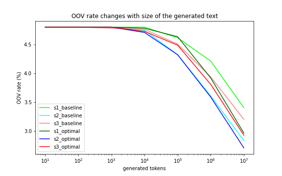
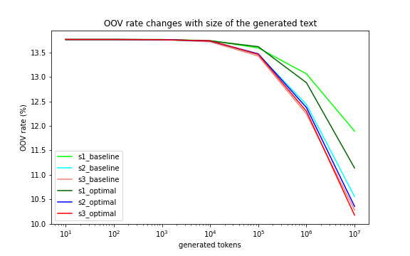

# SNLP project 

Name 1: Minh Tung Phung 
Id 1: 7012522 
Email id 1: miph00001@teams.uni-saarland.de 

Name 2: Pablo Valdunciel 
Id 2: 7010186  
Email id 2: pava00001@stud.uni-saarland.de  

## A. English 

### 0. Language overview
Some characteristics of the English language are:

- Native speakers: around 360 million
- Language family: 	Indo-European > Germanic > West Germanic > Ingvaeonic > Anglo-Frisian > Anglic > English
- Vocabulary size: 170,000 words, or 220,000 if obsolete words are counted.
- Writing system: 
    + written in [Latin alphabet](https://en.wikipedia.org/wiki/Latin_alphabet)
    + 26 letters, plus their corresponding capital form
    + 14 puntuaction marks
- Phonology: 
    + 24 consonant phonemes
    + pronunciation of vowels varies a great deal between dialects 

### 1. Data Preparation - Preprocessing 

**Assumptions**:
- Two-or-more end-of-line symbols (i.e. '\n\n') signify the separation of two paragraphs.
- No single sentence resides in more than one paragraph.
- We are allowed to use nltk for sentence-tokenization. The function from nltk (nltk.tokenize.sent_tokenize) is sufficient for the task.
- There is no situation where double-space (i.e. '  ') makes sense, so we contract all sequences of more than one space into a space character (i.e. from the regex point of view, ' +' is substituted with ' ').

**Operations**:
- Get a list of paragraphs by splitting the text by at-least-2 consecutive end-of-line characters (i.e. '\n{2,}').
- For each paragraph:
    + Replace all end-of-line characters with a space.
    + Contract all sequences of more than one space into a space character.
    + Tokenizer into sentences.
- Collect all sentences from all paragraphs as a list and return.

### 2. Subword Segmentation

In this section, we work on 3 segmentation models with difference vocabulary sizes. The first one employs character-level segmentation, which is simply to treat each character as a token, resulting in a vocabulary size of 74. In the rest of this section, we focus mostly on the other 2 models.

#### 2.1. Experiments with vocabulary sizes

There are 2 types of subword: small vocabulary size (i.e. usually from 100 to 800) and large vocabulary size (i.e. from 1500 to 3000). For each type, we do some experiments to choose an exact vocabulary size, which will be fixed for subsequent tasks.

**Approach**:

We propose to employ the [Minimum Description Length (MDL)](https://en.wikipedia.org/wiki/Minimum_description_length) principle to tackle this task. The MDL is a technique for model selection inspired by Occam's razor. In its basic form, MDL prefers the model which summarizes the data the best, i.e. the total size of the model and the description of the data given the model is the smallest.

For our current task, we formalize the description length as the total size of the model file, the vocab file and the encoded text file. In which, the model file and the vocab file represent the model, and the encoded file represents the data given the model.

To prevent from overfitting, we only consider vocab sizes rounded to hundredth, i.e. 100, 200, ..., 800 and 1500, 1600, ..., 3000. The best vocabulary size is chosen as the one which results in the smallest description length per the formulation above.

**Experiment details**:

a. Small vocabulary:

For small vocabulary sizes (from 100 to 800), the corresponding description length (or total file size) is shown in the figure below. The smallest description length belongs to the vocabulary size of 500.

One interesting observation is that the description length decreases sharply from vocabulary size of 100 to 200. For a qualitative evalution, let us look at an examplar sentence:

original text:

> There was a table set out under a tree in front of the house, and the March Hare and the Hatter were having tea at it: a Dormouse was sitting between them, fast asleep, and the other two were using it as a cushion, resting their elbows on it, and talking over its head.

vocab_size = 100:

> ▁ T he re ▁w a s ▁a ▁t a b l e ▁s e t ▁ ou t ▁ u nd er ▁a ▁t re e ▁ in ▁ f r o n t ▁o f ▁the ▁ h ou s e , ▁and ▁the ▁ M a r c h ▁ H a re ▁and ▁the ▁ H a t t er ▁w er e ▁ ha v ing ▁t e a ▁a t ▁ it : ▁a ▁ D o r m ou s e ▁w a s ▁s it t ing ▁b e t w e en ▁the m , ▁ f a s t ▁a s l e e p , ▁and ▁the ▁o t he r ▁t w o ▁w er e ▁ u s ing ▁ it ▁a s ▁a ▁c u s h i o n , ▁ re s t ing ▁the i r ▁ e l b o w s ▁o n ▁ it , ▁and ▁t a l k ing ▁o v er ▁ it s ▁ he a d .

vocab_size = 200:

> ▁T he re ▁was ▁a ▁t a b le ▁s et ▁ out ▁u nd er ▁a ▁t re e ▁in ▁f r on t ▁of ▁the ▁h ou se , ▁and ▁the ▁M ar ch ▁H a re ▁and ▁the ▁H at ter ▁w er e ▁ha v ing ▁t ea ▁at ▁it : ▁a ▁D or m ou se ▁was ▁s it t ing ▁be t w e en ▁the m , ▁f as t ▁as le e p , ▁and ▁the ▁o t her ▁t w o ▁w er e ▁u s ing ▁it ▁as ▁a ▁c u s h i on , ▁re st ing ▁the ir ▁e l b ow s ▁on ▁it , ▁and ▁t a l k ing ▁o ver ▁it s ▁he ad .

vocab_size = 500:

> ▁The re ▁was ▁a ▁t able ▁s et ▁out ▁u nder ▁a ▁t ree ▁in ▁fr on t ▁of ▁the ▁h ouse , ▁and ▁the ▁March ▁H are ▁and ▁the ▁Hatter ▁were ▁ha v ing ▁t ea ▁at ▁it : ▁a ▁Dormouse ▁was ▁s it ting ▁be t w een ▁them , ▁f ast ▁as le e p , ▁and ▁the ▁other ▁tw o ▁were ▁us ing ▁it ▁as ▁a ▁c us h ion , ▁re st ing ▁their ▁e l b ow s ▁on ▁it , ▁and ▁t al king ▁over ▁its ▁head .

For the size of 100, nearly every token is a character, which is obviously a bad sign since it cannot utilize the use of longer subwords or words to foster learning. Note that since this text has roughtly 72 characters, only 100-72=28 combinations of characters are taken as tokens for this size. 

For the size of 200, more meaningful combinations of characters are recognized as a token. In particular, the number almost quintuples from 28 to 128. As an example, *'ing'* has its own place. This explains the great drop in the description length.

This trend continues up to the size of 500, where the trade-off between generality and specificity of adding new tokens equalizes. Most of the stopwords, which are very frequent, occupy their own tokens. Meaningful suffixes like *'able'* now also have their own place. 

While a vocabulary size of 500 is quite small in practice, we believe it is suitable for our current problem since the input text file is small.

b. Large vocabulary

For large vocabulary sizes (from 1500 to 3000), we apply the same procedure as described. The description lengths corresponding to different sizes are shown below: 

It can be observed from the figure that the larger the vocabulary size, the longer the description length. We suspect that this is because 1500 is already bigger than the optimal size, thus adding more tokens only makes things worse. For the purposes of the next tasks, we will use the size of 1500 for the large vocabulary size.

Regarding the example above, let us look at how the sentence is segmented:

vocab_size = 1500:

> ▁There ▁was ▁a ▁table ▁set ▁out ▁under ▁a ▁t ree ▁in ▁fr on t ▁of ▁the ▁house , ▁and ▁the ▁March ▁Hare ▁and ▁the ▁Hatter ▁were ▁having ▁tea ▁at ▁it : ▁a ▁Dormouse ▁was ▁sitting ▁bet w een ▁them , ▁f ast ▁asleep , ▁and ▁the ▁other ▁two ▁were ▁us ing ▁it ▁as ▁a ▁c ush ion , ▁rest ing ▁their ▁el b ow s ▁on ▁it , ▁and ▁talking ▁over ▁its ▁head .

We can see that most of the words are standing alone as a token. This becomes close to word-level segmentation, which may potentially reduce the advantages of using sub-words for handling OOV.

#### 2.2. Training of Segmentation models

**Operations**:
- We train 3 segmentation models of different vocabulary sizes:
    - character-level segmentation.
    - small subword vocabulary size of 500.
    - large subword vocabulary size of 1500.
- For each vocabulary size, we:
    - train a segmentation model.
    - apply the model on the training data to get an encoded text.
    - decode the encoded text, verify that the decoded text is the same as the original training data to ensure the correctness of the model.
    - apply the same encoding, decoding operations on the test data.    

### 3. Language Model training

#### Baseline models

The table below shows the baseline validation perplexity for the 3 models on the default hyperparameters:

| s1 (character-granularity, vocab size 74)       | s2 (vocab size 500)    | s3 (vocab size 1500)    |
| :------------- | :----------: | -----------: |
|  5.257669 | 33.814382   | 85.886606   |

#### Experiments

**Approach**:

To cover a wide range of hyperparameter values, we employ grid search.

**Operations**:

For each model, we do grid search on 3 hyperparameters: 
- `hidden`: the number of neurons in the hidden layer,
- `bptt`: the number of steps in time that error is backpropagated,
- `class`: the number of classes for class-based LM.

The exact list of values for each hyperparameters can be seen in the code. Note that for the `hidden`, we set an upperbound of 200 as suggested by the authors of the [rnnlm toolkit](http://www.fit.vutbr.cz/~imikolov/rnnlm/FAQ.txt) for small texts with less than 1M words. For the `class`, all values greater than or equal to 1500 are equivalent (since the maximum vocabulary size we selected in the previous section is 1500). Here we set an upperbound of 1501.

**Observations**:

The following plots show how the perplexity of the model varies when changing each of the hyperparameters, while leaving the rest fixed. 

The first plot shows the perplexity values for different sizes of the `hidden` layer of the RNNLM for a fixed value of `bptt` and `class`. In all cases, increasing the number of hidden layers gives a lower (better) perplexity. For `s1`and `s2`, changing from 5 to 20 hidden neurons implies a huge decrease. The intensity of change is lessened when there are more and more neurons. From 100 neurons onwards, the differences are negligible.

The second plot shows how the perplexity varies with `bptt`. In general, this hyperparameter does not have a big impact to the perplexity. While for `s1` and `s2`, increasing `bptt` from 0 to 1 results in slightly better perplexities, the reverse is true for `s3`. Higher values of `bptt` then have almost no impact to the perplexity on average.

The variation of the perplexity for different values of `class` is shown in the third plot. From 100, increasing the number of classes usually reduces the perplexity for the three vocabulary sizes. There is a trade-off between model performance and training speed: a higher value of `class` requires longer time to train but may result in a marginally better performance and vice versa.

Another interesting observation is that the overall performance of `s1` is much better than `s2`, which in turn is much better than `s3`. **We suspect this is because the *rnnlm toolkit* misunderstood the spaces in the input files (which represent separation between tokens) as meaningful characters of the text**. Thus, for `s1`, it can just predict that for any non-space character, the next character is a space, and then it has half of the predictions correct, which results in such a low perplexity. Since we are more focused on OOV handling but not perplexity optimization, we ignore this problem for the rest of the project.

**Results**:

There are different approaches to select the sets of optimal hyperparameters base on the above results and observations. One may follow Occam's Razor and prefer small values for the hyperparameters as long as the perplexity is only slightly higher than the minimum one. Another may directly choose the sets of values that result in the optimal perplexities. For simplicity, we opt for the second approach.

The configurations of hyperparameters that minimize the perplexity of the model for each vocabulary size are: 

| vocab | hidden | bptt | class | (perplexity) |
|-------|--------|------|-------|--------------|
| s1    | 200    | 3    | 100   | 3.96         |
| s2    | 200    | 3    | 1501  | 31.36        |
| s3    | 40     | 0    | 1501  | 81.27        |

### 4. Text generation

We generate texts of different lengths for each of the 6 language models (3 baseline and 3 optimal models) from section 3. The generated texts are then decoded by the corresponding segmentation models. Next, we compare the artificial texts of length 100:

`s1 baseline`:
> Withle his hear very time a lid shoup of bith could arraution pogg a won't ince: boghmendhed insee 

`s2 baseline`:
> Alice began little lesson--thege in courthed pice, as prie was the Criter kipp now in Wet, twink on, cards have cometely to that is any haird.  
`What hildider that flay too much nerept the way of you werehadge, will I can't anything out in your inter, if they'

`s3 baseline`:
> he took the Duchess--' to!'  
\`No are that,' said Alice, and all a nl t argo, beginning!'  
\`It's it how?'  
Arills all, I have go out of any a thing it written.'  
O E did you tast either you,' said the Mock Turtle; \` swro idea anyab came to know when the Nes!  
\`It's begunered to see them about, when I can tell you more

`s1 optimal`:
> \`If her head of a.'  
\`I should this losk, deen tone; \`But that's at remarked,' Alice found Alice, a

`s2 optimal`:
> Atter used the time in looked blows at the guess of the book, and he found on the pimmiast, the children last nearly.  
And she was goved, little she thought peep at it, so went to sure.  
poolowing the biture: but Alice toom at the musost, and a great song that s

`s3 optimal`:
> She said the Lpoty is, \` soon knew her teanher of a Fock tearenion, beautifulidly, and began finished her feet, that had an moral to get off; and behind it, and a great hard sadceen in that, howb jo under a poor little anything viola quietly.  
\`There's getting likeer about at them soto.  
said the Gryphon remarked, \`and this ear turned a tone of them sisterass

It can be seen that for both baseline and optimal models, the 3 texts have differences in length (in terms of number of characters). Since `s1` use only single characters as tokens, the text it generates is the shortest. On the other hand, `s3` generates the longest text because it uses more lengthier combinations of characters.

Overall, the optimal models show a better performance over the baseline models. This agrees with the reduction in perplexity that the optimal models were optimized for.

Regarding the optimal models, it looks like `s2` gives the highest quality of text. 
* For `s1`, the context seems very "short", each sentence comprises a small number of words, and words at moderate distance seems to be unrelated to each other. We deem this problem to be a consequence of using very short tokens (i.e. character tokens). For example, let's say the RNN LM can regard the last 10 tokens to generate the next token, if all those last 10 tokens are characters, then that effectively means our LM only has a context of 2 or 3 words. In contrast, if those tokens are all words themselves, then our LM has a larger context of 10 words.
    
* The same reasoning applies to explain why the text from `s3` gives longer sentence on average compared to the other models. Another observation taken from `s3` is that the generated text has many "meaningless" words like `teanher`, `tearenion`, `beautifulidly`. Note that these words didn't appear in the training data but rather are made up by the language model (by combining sub-words). The reason, as we suspect, is that since `s3` uses a large vocabulary size on a small training dataset, the statistics on its tokens are not significant (i.e. have low support), resulting in a bad performance.

* The text generated by `s2`, while still has many flaws, seems to be most realistic. Among the 3 models, `s2` does the best job on balancing between generality and specificity of the tokens, as well as maintaining a reasonable support for them.

### 5. OOV comparison

In this section, we compare the OOV rate of the original vocabulary and the augmented vocabularies from generated texts. (Note that we pre-process the texts with lower-casing and punctuation removal before computing OOV rates.)

While the original OOV rate is 4.80\%, augmenting the vocabulary with RNNLM's generated texts can effectively reduce this number, as shown in the below table and figure:

| model\gen size | $10^1$ | $10^2$ | $10^3$ | $10^4$ | $10^5$ | $10^6$ | $10^7$ |
|----------------|--------|--------|--------|--------|--------|--------|--------|
| s1_baseline    | 4.80%  | 4.80%  | 4.80%  | 4.80%  | 4.62%  | 4.21%  | 3.41%  |
| s2_baseline    | 4.80%  | 4.80%  | 4.80%  | 4.75%  | 4.33%  | 3.61%  | 2.83%  |
| s3_baseline    | 4.80%  | 4.80%  | 4.79%  | 4.77%  | 4.51%  | 3.94%  | 3.20%  |
| s1_optimal     | 4.80%  | 4.80%  | 4.80%  | 4.79%  | 4.64%  | 3.92%  | 2.96%  |
| s2_optimal     | 4.80%  | 4.80%  | 4.80%  | 4.71%  | 4.33%  | 3.59%  | 2.71%  |
| s3_optimal     | 4.80%  | 4.80%  | 4.80%  | 4.73%  | 4.49%  | 3.81%  | 2.93%  |

**Observations**:
* There are almost no improvement in OOV rates if the augmenting text is small (i.e. less than or equal to $10^3$ tokens). OOV rates start decreasing from $10^4$ tokens, but the reduction is still quite small at that stage. OOV rates get lower with longer generated texts.
* From $10^5$ to $10^7$ tokens, the OOV rates of most models go almost linearly to the log of generated text size.
* Overall, given the same vocabulary size, the optimal models reduce the OOV rate better than the baseline models, especially when the number of generate tokens is significant (i.e. $10^6$ and $10^7$).
* In general, `s2` gives a better OOV rate than the other 2 models. This align well with our observation from above sections, where `s2` also showed superior results in terms of MDL and perplexity. 
* For practical applications, we would prefer `s2_optimal` over its counterparts.

## B. Bengali

### 0. Language overview
Some characteristics of the Bengali language are:

- Native speakers: around 230 million
- Language family: Indo-European > Indo-Iranian > Indo-Aryan > Eastern Zone > Bengali-Assamese > Bengali
- Vocabulary size: 100,000 separate words
- Writing system: 
    + written in [Bengali  alphabet](https://en.wikipedia.org/wiki/Bengali_alphabet), a part of the [Bengali–Assamese script](https://en.wikipedia.org/wiki/Bengali%E2%80%93Assamese_script). It is an [abugida](https://en.wikipedia.org/wiki/Abugida), a segmental writing system in which consonant-vowel sequences are written as units; each unit is based on a consonant letter, and vowel notation is secondary. 
    + Bengali punctuation marks, apart from the downstroke দাড়ি dari (।), the Bengali equivalent of a full stop, have been adopted from western scripts and their usage is similar
- Phonology: 
    + 29 consonants 
    + 7 vowels, as well as 7 nasalised vowels

### 1. Data Preparation - Preprocessing 

**Assumptions:**
- Two-or-more end-of-line symbols (i.e. '\n\n') signify the separation of two paragraphs.
- Two or more exclamation(!)/interrogation(?)/full stop(।) doesn't follow the grammatical rules; it is 
    most likely used by the writer to emphasize whatever they are saying.
- The end of a sentence is determined by an exclamation (!), an interrogation (?) or a full stop (।)
- The corpus is probably from a web page, since it includes HTML labels
- Presence of text in English

**Operations**: 
- Get a list of paragraphs by splitting the text by at-least-2 consecutive end-of-line characters (i.e. '\n{2,}').
- For each paragraph:
    + Substitute two or more exclamations/interrogations/full stops by a single one
    + Remove HTML tags
    + Remove text in English  
    + Split text in sentences using the [bltk library](https://github.com/saimoncse19/bltk)
- Collect all sentences from all paragraphs as a list and return.

### 2. Subword Segmentation

In this section, we work on 3 segmentation models with difference vocabulary sizes. The first one employs character-level segmentation, which is simply to treat each character as a token, resulting in a vocabulary size of 55. In the rest of this section, we focus mostly on the other 2 models.

#### 2.1. Experiments with vocabulary sizes

There are 2 types of subword: small vocabulary size (i.e. usually from 100 to 800) and large vocabulary size (i.e. from 1500 to 3000). For each type, we do some experiments to choose an exact vocabulary size, which will be fixed for subsequent tasks.

**Approach**

We use the same principle used with the English corpus to select the optimal vocabulary sizes: [Minimum Description Length (MDL)](https://en.wikipedia.org/wiki/Minimum_description_length).

a. Small vocabulary 

For small vocabulary sizes (from 100 to 800), the corresponding description length (or total file size) is shown in the figure below. Increasing the vocabulary size decreases the description length, being 800 the optimal vocabulary size within this range.

We examine the different segmentations of an example sentence to try to understand how the models behave for the Bengali language: 

original text: 

> তোবে এভাবে তার দিকে ধেয়ে যাওয়া কখনো কাম্য নয়।

> Tōbē ēbhābē tāra dikē dhēẏē yā'ōẏā kakhanō kāmya naẏa.

>However, it is never desirable to rush towards him like this.

vocab_size = 100: 
> ▁ত ো বে ▁এ ভ া বে ▁ত ার ▁দ ি কে ▁ ধ ে য়ে ▁য া ও য়া ▁ক খ ন ো ▁ক া ম ্য ▁ন য় ।

> ▁Ta ̔ō bē ▁ē bha ̔ā bē ▁ta ̔āra ▁da ̔i kē ▁ dha ̔ē ẏē ▁ya ̔ā ō ẏā ▁ka kha na ̔ō ▁ka ̔ā ma ya ▁na ẏa.

vocab_size = 300: 
> ▁তো বে ▁এ ভ াবে ▁তার ▁দি কে ▁ধ েয়ে ▁যা ওয়া ▁ক খন ো ▁কা ম ্য ▁ন য় ।

> ▁Tō bē ▁ē bha ̔ābē ▁tāra ▁di kē ▁dha ̔ēẏē ▁yā ōẏā ▁ka khana ̔ō ▁kā ma ya ▁na ẏa.

vocab_size = 500: 
> ▁তো বে ▁এ ভাবে ▁তার ▁দি কে ▁ধ েয়ে ▁যা ওয়া ▁ক খন ো ▁কা ম ্য ▁নয় ।

> ▁Tō bē ▁ē bhābē ▁tāra ▁di kē ▁dha ̔ēẏē ▁yā ōẏā ▁ka khana ̔ō ▁kā ma ya ▁naẏa.

vocab_size = 800:

> ▁তো বে ▁এ ভাবে ▁তার ▁দি কে ▁ধ েয়ে ▁যা ওয়া ▁কখন ো ▁কা ম ্য ▁নয় ।

> ▁Tō bē ▁ē bhābē ▁tāra ▁di kē ▁dha ̔ēẏē ▁yā ōẏā ▁kakhana ̔ō ▁kā ma ya ▁naẏa.
 
b. Large vocabulary

For large vocabulary sizes (from 1500 to 3000), we repeat the procedure. The description lengths corresponding to different sizes are shown below.

The minimal description length is obtained for the vocabulary size 1700.

Regarding the above example, choosing a vocabulary size of 1700 gives the following result:

original text: 

>তোবে এভাবে তার দিকে ধেয়ে যাওয়া কখনো কাম্য নয়।

> Tōbē ēbhābē tāra dikē dhēẏē yā'ōẏā kakhanō kāmya naẏa.

>However, it is never desirable to rush towards him like this.

vocab_size = 1700:

>▁তো বে ▁এভাবে ▁তার ▁দিকে ▁ধ েয়ে ▁যা ওয়া ▁কখনো ▁কাম ্য ▁নয় ।

> ▁Tō bē ▁ēbhābē ▁tāra ▁dikē ▁dha ̔ēẏē ▁yā ōẏā ▁kakhanō ▁kāma ya ▁naẏa.

#### 2.2. Training of Segmentation models

**Operations**:
- We train 3 segmentation models of different vocabulary sizes:
    - character-level segmentation.
    - small subword vocabulary size of 800.
    - large subword vocabulary size of 1700.
- For each vocabulary size, we:
    - train a segmentation model.
    - apply the model on the training data to get an encoded text.
    - decode the encoded text, verify that the decoded text is the same as the original training data to ensure the correctness of the model.
    - apply the same encoding, decoding operations on the test data.    

### 3. Language Model training

#### Baseline models

The table below shows the baseline validation perplexity for the 3 models on the default hyperparameters:

| s1 (character-granularity, vocab size 55)       | s2 (vocab size 800)    | s3 (vocab size 1700)    |
| :------------- | :----------: | -----------: |
| 7.368929  | 94.109742  |  176.930043  |

#### Approach 

We take into account the results of the grid search of the hyperparameters `hidden`, `bptt` and `class` for the English models to avoid a grid search for Bengali (it take much longer time to do experiments on the Bengali corpus). We choose the following values for the three Bengali models (`s1`, `s2` and `s3`): 

- `hidden=200`: we learned that the more neurons in the hidden layer, the lower the perplexity. We select again the maximum number of hidden neurons recommended by the authors of the [rnnlm toolkit](http://www.fit.vutbr.cz/~imikolov/rnnlm/FAQ.txt).

- `bptt=4`: we learned that modifying the number of backpropagation steps doesn't affect the perplexity of the model much, so we keep this hyperparameter fixed (with the same value as in the baseline configuration).

- `class=1700`: we select a number of classes equal to the optimal vocabulary size, i.e. 1700.

##### Results 

The perplexity of the three models using the above mentioned configuration are:

| vocab | hidden | bptt | class | (perplexity) |
|-------|--------|------|-------|--------------|
| s1    | 200    | 4    | 1700  | 5.20         |
| s2    | 200    | 4    | 1700  | 77.24        |
| s3    | 200    | 4    | 1700  | 170.361866   |

### 4. Text generation

We generate texts of different lengths for each of the 6 language models (3 baseline and 3 optimal models) from section 3. The generated texts are then decoded by the corresponding segmentation models. We translate the texts from Bengali to English using [Google Translator](https://translate.google.com/) to gain some understanding of the content of the generated texts. Of course, when Google Translator, we must take into account that it has the ability to auto-correct word and grammar errors, giving better results in English than the original results in Bengali.  Next, we compare the artificial texts of length 100: 

`s1 baseline`:
> টারা হচুন না অনশালে দিস আর করা শক্যোথা নাই জদিও আজতে দ্বকি তাইসবিল অপরতো তুই থেকে কোন অনেক ক্রকা রু

> Tara hachun na anshale dis aar kara shakyotha nai jadio aajte dbki taisbil aparato tui to ko kanai kroka ru

`s2 baseline`:
> সাকিব নেওয়ামী ভাষাও প্রথম না তাকে সাংবাদিক নেয়ত !
যে সাদাত করে দেন কিছু হোক।
অশনকজনীতি ছাড়া কাকে চিত্রোন নবীতে পারেছে খুব মজা পাইলে খুদানি পাপন সাহেব অনেক ধন্যবাদ কেন?
আন্দতেল আমি।
তাকিয়ে দেখলাম।
এই লোককেও বলছিলো চিনিতে মারছি, রইলব ইবিবা

> Shakib Newami language was not the first to take him as a journalist!
Whatever you make sadat.
If you have a lot of fun in Chitron Nabi without Ashanakaniti, why is Mr. Khudani Papon thank you so much?
Andtel I.
I looked.
This guy was also saying I was hitting with sugar, Raylab Ibiba

`s3 baseline`:
> সাকিবলাও কেন ছিলসাকিব মোমো হুজুর ।
রাজনীতি হুজুর এবং বুয়ে গেলোও আর বাঁচার কৃজলায় ডগলো করা দরকার আছে আল্লাহর মজারিদের আছাদ মুদের কাছে যদিবাসী লোদা বলবে উনি ওগানজিথা।
বাংলার চরিত্র নিয়ে দেকবো তার সিলেজের চুল কেউ মনে হয় আর রিস্টে বোমনি এটাতো নারীর ষনীতি করে ভিডিও টা দেখছেন এক জনন আবার চোরশালা এ জানতে নিয়

>Why was Shakibala also Shakib Momo sir.
Politics, sir and brother-in-law, but it is necessary to dodge the misery of survival, if the people of Loda say that he is Oganjitha.
I will look at the character of Bengal, I think the hair of his silage is someone, and in the wrist, Bomni is watching the video of a woman being sexually assaulted.

`s1 optimal`:
>“ভিডিও থেকে একটি গল্প্রান্ধু হয়।
খানকিকুত্তার বাচ্চাহাজিয়ে যত্তকে বাস্তব যত দিন আসে সব কত বড় যু

>“There is a story-teller from the video.
How big is all the real days when the bitch's baby hajiye yatake real

`s2 optimal`:
>ভাইয়া আজ আবার ও  আসুনুটে যতখন এক খালেদায়েক,
তিন পোড়ুন খেলা চিতবেতার বোদায় হায়রে বিপক্ষা, বাংলার দফাড়াতের ভুদির ছি শালা তোর বাগি নাস্তিক ভন্ড কুত্তার বাচ্চা আবাল বাঁকিয়ে তুই ইউটিউব লাথালী ও ছোট বেলা থেকে যেতে হয়তো এই রকম বং্গালের সনয়তি কে ধরে নিয়ে যাচ্ছে

> Brother, come again today and as long as one Khaledayek,
Alas for the three-burned game Chitbetar Boda, Alas for the opposition

`s3 optimal`:
> সিনেমা টা ভালো করে সেইভাবে একটু টাইমে নাই ওয়ামত ও নাচেগেছে মিডিয়াতে লাখ টাকা কাওয়া কাদের বা সারা মোটাফ্যাপি তোমাকেন,,,আরতেই ঘুষখোরটা সাজল শি কি খায় আর মেয়েটার সাবস্ক্রাইব করছে একডিয়া আর দিন গ্রেপ্তন করলাম সবাই কিন পৃথিবীতে কত বড় আছে আমি বাংলাদেশের কত দিতে গিয়ে।
আজ আমার মনে ছিলো না এখানে ডেল করে!
যে খারাপ সালা

> The movie is not doing well like that. Wamat and Nachegeche are dancing in the media for lakhs of rupees. Kawa Kader or Sara Motafapi Tomaken.
I didn't think Dale was here today!
That bad sala

Once again, it can be seen that the three text have different lengths with `s1` < `s2` < `s3`, which is coherent with the vocabulary that each model uses.

Regarding the quality of the generated texts, we can only comment on the automatic translations given by Google Translator. 

- In general, the quality of the generated texts seems equally good. This constrasts with the poorer results that the model `s1` for English gave. Each symbol of the Bengali language denotes a consonant followed by a particular vowel that is implicit; there are explicit vowels too. The way in which the Bengali writing systems works, allows the model `s1` to have enough context using simply the vocabulary corresponds with the alphabet.

### 5. OOV comparison

In this section, we compare the OOV rate of the original vocabulary and the augmented vocabularies from generated texts.

The original OOV rate for the Bengali language is 13.07%. Augmenting the vocabulary with RNNLM's generated texts can effectively reduce this number, as shown in the below table and figure:

| model\ gen. size | $10^1$ | $10^2$ | $10^3$ | $10^4$ | $10^5$ | $10^6$ | $10^7$ |
|------------------|--------|--------|--------|--------|--------|--------|--------|
| s1 baseline      | 13.76% | 13.76% | 13.76% | 13.74% | 13.59% | 13.06% | 11.89% |
| s2 baseline      | 13.76% | 13.76% | 13.76% | 13.73% | 13.46% | 12.44% | 10.56% |
| s3 baseline      | 13.76% | 13.76% | 13.76% | 13.72% | 13.43% | 12.24% | 10.28% |
| s1 optimal       | 13.76% | 13.76% | 13.76% | 13.74% | 13.62% | 12.88% | 11.14% |
| s2 optimal       | 13.76% | 13.76% | 13.76% | 13.73% | 13.47% | 12.37% | 10.35% |
| s3 optimal       | 13.76% | 13.76% | 13.76% | 13.74% | 13.46% | 12.30% | 10.17% |

#### Observations

+ The OOV-rate starts to decrease only when  $10^5$ tokens have been generated to extend the vocabulary. For `s2`and `s3`, the OOV-rate starts to decrease at $10^4$, but the reduction is of just 0.03%.

+ From $10^5$ to $10^7$, the decrease in the OOV-rate is more notiaceable, with a reduction of more than 3% for $10^7$.

+ Among the different models, we see that `s1` is clearly worse. `s2`and `s3`are nearly identical, but `s3` achieves a OOV-rate slightly lower.

## Overall Analysis
Some ideas for this section:
* What we aim to achieve: 
    * reduce OOV rate.

* Whether our expectations were fulfilled: 
    * yes, we use perplexity to tune the language models, and the generated texts from the tuned models reduce OOV rate more than the counterpart from baseline models.

* What are our takeaways from this project? 
    * ?
    * sub-words, at an appropriate granularity, is better than character-level and word-level tokens. Sub-words help with inference of meaningful words that didn't appear in the training.
    * We can reduce OOV rate by augmenting the vocabulary using the generated text.

* How do your results differ for English and Bengali?
    * Why there is a difference in the optimal vocab size (500 for English and 1700 for Bengali)? Maybe because Bengali is a more morphologically rich language.
    * Why the overall OOV rates of English is smaller than Bengali eventhough the training size for English is much smaller? Also because of morphology.
    * For Bengali, the reduction in OOV rates of the tuned models compared to the baseline models is less significant than in the English models. One reason maybe we don't properly tune the hyperparameters for the Bengali models, but only infer from our observations from English models.

* What hyperparameters do you use to optimise the OOV rates? 
    * vocab size (using MDL),
    * rnnlm's hyperparameters: hidden, class, bptt. bptt does not really have a big impact. Higher values for hidden usually mean better result. Set class = vocab size seems to be the best.

* Are there any ways you could improve your results?
    * For hyperparameter tuning (in section 3), choosing the Occam's Razor approach.
    * Do proper tuning for Bengali.
    * Use more and varied training data.
    * Try different model architectures (e.g. transformer, SVM).